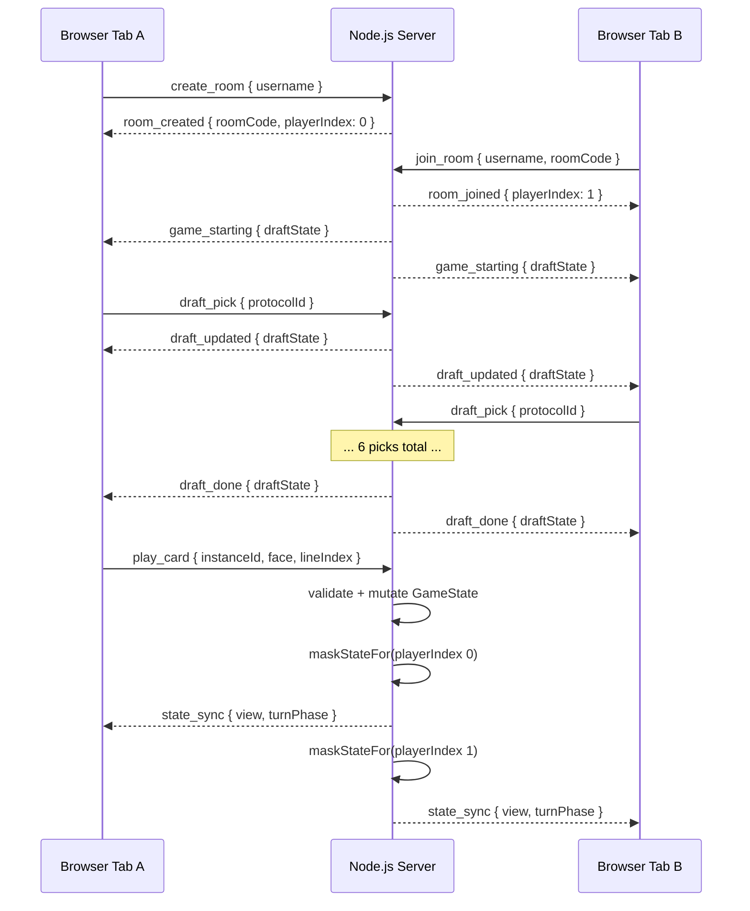
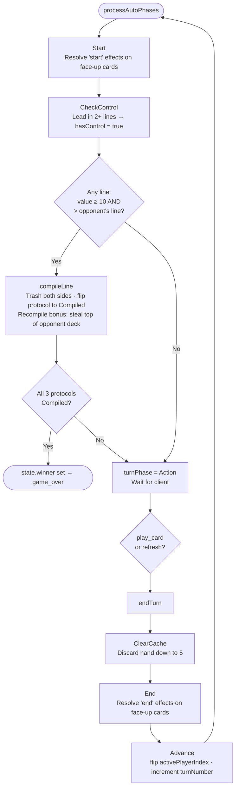

# Compile — Technical Reference

## Why Two Terminals?

The project is split into two independent processes that must run simultaneously:

| Terminal | Command | What it runs | Port |
|---|---|---|---|
| **1** | `npm run dev:server` | Node.js game server (Express + Socket.io) | 3000 |
| **2** | `npm run dev:client` | Vite dev server serving the Phaser browser client | 5173 |

The **server** owns all game state and enforces the rules. It never serves HTML.  
The **client** is a static Phaser.js app served by Vite. It connects to the server via WebSocket and renders the game, but holds no authoritative state.

During development, Vite proxies `/socket.io` requests from port 5173 → port 3000 (configured in [client/vite.config.ts](client/vite.config.ts)), so the browser only talks to `localhost:5173` and CORS is never an issue.

---

## Tech Stack

### Shared (`shared/`)
- **TypeScript** — all types, enums, and socket event signatures are defined once here and imported by both server and client. This gives end-to-end type safety across the network boundary.
- Key types: `GameState`, `PlayerView`, `DraftState`, `CardInstance`, `TurnPhase`, `ServerToClientEvents`, `ClientToServerEvents`.

### Server (`server/`)
| Layer | Technology | Role |
|---|---|---|
| Runtime | **Node.js** | JavaScript runtime |
| HTTP | **Express** | Minimal HTTP server; needed to attach Socket.io |
| WebSocket | **Socket.io** | Real-time bidirectional events; handles reconnection, rooms |
| Language | **TypeScript** via `tsx` | Type-safe server code; `tsx watch` gives hot-reload in dev |
| IDs | **uuid** | Unique `instanceId` per card in play |

### Client (`client/`)
| Layer | Technology | Role |
|---|---|---|
| Game engine | **Phaser 3** | Scene management, input, 2D rendering (WebGL/Canvas) |
| Dev server / bundler | **Vite** | Fast HMR during development; bundles for production |
| WebSocket | **socket.io-client** | Typed client matching server events |
| Language | **TypeScript** | Shared type imports from `@compile/shared` |

---

## Architecture: Server-Authoritative



The server **never trusts the client** to compute game state. Every action (play card, refresh, draft pick) is validated server-side and rejected with `action_rejected` if illegal. The client only sends *intent* and re-renders whatever state the server broadcasts back.

---

## Core Data Flows

### 1. Room Creation & Join
1. Player A emits `create_room { username }`.
2. `RoomManager` generates a random 6-character alphanumeric code, creates a `Room`, stores the socket, and emits `room_created { roomCode, playerIndex: 0 }`.
3. Player B emits `join_room { username, roomCode }`.
4. `RoomManager` looks up the room, adds Player B (index 1), emits `room_joined { playerIndex: 1 }` to B.
5. With 2 players present, `room.startDraft()` broadcasts `game_starting { draftState }` to both.

### 2. Draft Phase
- Pick order is hard-coded as `[0, 1, 1, 0, 0, 1]` (player 0 picks 1, player 1 picks 2, player 0 picks 2 — matching the 1+2 / 2+1 rule).
- `DraftEngine.applyDraftPick()` validates it's the right player's turn, removes the chosen protocol from `availableProtocols`, and appends to `picks`.
- After 6 picks, `draft_done` is sent; `Room.startGame()` calls `buildDeck()` for each player (one UUID'd `CardInstance` per card def, shuffled via Fisher-Yates), deals 5 to each hand, and calls `processAutoPhases()` to begin turn 1.

### 3. Turn Execution
Each turn processes these phases automatically in sequence on the server before waiting for player input:



### 4. State Delivery (Masking)
After every mutation, `broadcastState()` calls `buildPlayerView(state, i)` for each player. This function returns a `PlayerView` where the opponent's face-down cards are replaced with `{ instanceId, hidden: true }` — the opponent never knows the card identity. The full `ServerGameState` (with both full hands and decks) only ever lives in server memory.

### 5. Card Effects
`CardEffects.enqueueEffectsFromCard(state, ownerIndex, cardDefId, trigger)` enqueues `PendingEffect` entries onto `state.effectQueue` for the given trigger (`"immediate"`, `"start"`, or `"end"`). Effects execute one at a time via `resolveNextEffect()` → `executeEffect()`.

Effects that require a player choice set `state.phase = "EffectResolution"` and wait for the client to emit a `resolve_effect` socket event with `{ targetInstanceId?, targetLineIndex?, newProtocolOrder?, swapProtocolIds? }`. Non-interactive effects resolve immediately without suspending the turn.

All 42 active effect types are fully implemented. Use `isCardCovered(state, instanceId)` to check whether a card is covered (not the topmost card in its line).

**Passive effects** (`trigger: "passive"`) are evaluated outside the queue at specific hook points:
- **Value modifiers** (`value_bonus_per_facedown`, `facedown_value_override`, `reduce_opponent_value`) — read eagerly in `lineValue()` each time a line's total is needed.
- **Play denials** (`deny_facedown`, `deny_play_in_line`, `deny_faceup`) — checked in `checkPlayDenials()` on every `playCard()` call.
- **On-cover hooks** (`on_covered`, `on_covered_delete_self`, `on_covered_flip_self`, `on_covered_delete_lowest`, `on_covered_deck_to_other_line`, `on_covered_or_flip_delete_self`) — fired in `enqueueEffectsOnCover()` whenever a card becomes covered.
- **After-event triggers** (`after_delete_draw`, `after_opp_discard_draw`, `after_clear_cache_draw`, `after_draw_shift_self`, `on_compile_delete_shift_self`) — fired inline at their respective event sites in `executeEffect()`, `endTurn()`, and `compileLine()`.

17 of 18 passive types are implemented; `ignore_mid_commands` (apy_2) is declared but not yet wired in. See `card-effects-status.md` for the full breakdown.

---

## Key Files

```
shared/src/index.ts            — Single source of truth for all types & socket events

server/src/index.ts            — Express + Socket.io bootstrap, event routing
server/src/room/RoomManager.ts — Room lifecycle (create / join / disconnect)
server/src/room/Room.ts        — Per-room state machine: draft → game → over
server/src/game/DraftEngine.ts — Pick order, deck build, Fisher-Yates shuffle
server/src/game/GameEngine.ts  — Turn phases, compile rule, play/refresh actions
server/src/game/CardEffects.ts     — Effect resolver: 42 active + 17 passive effect types, effectQueue, EffectResolution phase
server/src/game/StateView.ts   — Masks opponent face-down cards for each player's view
server/src/data/cards.ts       — Placeholder card & protocol definitions (36 cards / 6 protocols)

client/src/main.ts             — Phaser game config & scene list
client/src/scenes/MenuScene.ts — Username, create/join room, copy room code
client/src/scenes/DraftScene.ts— Pick order tracker, protocol card grid, picks summary
client/src/scenes/GameScene.ts — Full game board: lines, hand, HUD, face-down toggle
client/src/scenes/GameOverScene.ts — Winner display, play again
client/src/objects/CardSprite.ts   — Phaser card visual (face-up / face-down / hidden)
client/src/data/cardDefs.ts    — Client-side card name/value mirror (server-independent)
client/src/network/SocketClient.ts — Typed socket.io-client singleton
client/vite.config.ts          — Vite dev proxy: /socket.io → localhost:3000
```

---

## Adding New Cards

When adding new cards to the game:

1. **Update `server/src/data/cards.ts`** — add/replace `CommandCardDef` entries with correct values and `CardEffect` objects.
2. **Update `client/src/data/cardDefs.ts`** — mirror the display data (name, value, effect description text).
3. **Extend `server/src/game/CardEffects.ts`** — add a new `case` inside `executeEffect()` for any new `effect.type` strings. For passive effects that evaluate outside the queue, wire them into the appropriate hook point (`lineValue()`, `checkPlayDenials()`, `enqueueEffectsOnCover()`, or an inline event site).
4. If the effect requires a player to choose a target, set `state.phase = "EffectResolution"` and return early. The client emits `resolve_effect` with `targetInstanceId`, `targetLineIndex`, `newProtocolOrder`, or `swapProtocolIds`; `continueAfterEffects()` resumes normal play once the queue is empty.
