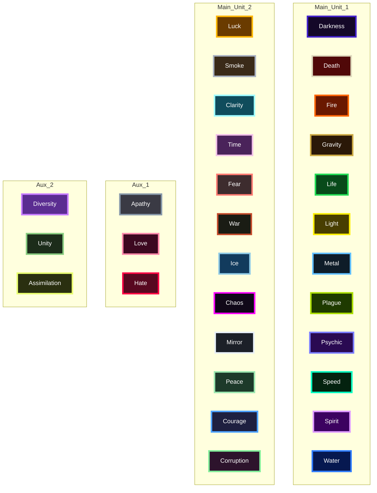

# Protocol Color Map

This map uses both protocol color dimensions in one node:

- Fill color = primary color (`PROTOCOL_COLORS`)
- Border color = accent color (`PROTOCOL_ACCENT_COLORS`)

## Hex Table

| Protocol | Primary | Accent |
|---|---|---|
| Apathy | `#3a3a44` | `#8899aa` |
| Darkness | `#140828` | `#4422cc` |
| Death | `#500808` | `#ddd8bb` |
| Fire | `#6a1800` | `#ff6600` |
| Gravity | `#2a1808` | `#ccaa44` |
| Hate | `#580820` | `#ff0044` |
| Life | `#084a1a` | `#22dd55` |
| Light | `#483e00` | `#ffee00` |
| Love | `#3c0820` | `#ff88aa` |
| Metal | `#0e1c28` | `#60c0ff` |
| Plague | `#1e3a00` | `#aadd00` |
| Psychic | `#2a0a52` | `#7a7dff` |
| Speed | `#04220f` | `#00ffc2` |
| Spirit | `#3c0260` | `#dd99ff` |
| Water | `#061850` | `#2f7dff` |
| Diversity | `#5b2d91` | `#c77dff` |
| Luck | `#6a3b00` | `#ffb703` |
| Smoke | `#3a2a18` | `#a8b0c0` |
| Clarity | `#0f4c5c` | `#9ffcff` |
| Unity | `#1c2c1a` | `#88cc80` |
| Time | `#4a235a` | `#f1c0e8` |
| Fear | `#3d2c2e` | `#ff7b72` |
| War | `#1a1c14` | `#c44b2b` |
| Ice | `#123b5d` | `#8ecae6` |
| Chaos | `#100818` | `#ff00ff` |
| Mirror | `#1c2028` | `#e8f0f8` |
| Peace | `#1d3a2a` | `#9be7b0` |
| Assimilation | `#2a2f10` | `#e9ff70` |
| Courage | `#1e2040` | `#4da3ff` |
| Corruption | `#2d132c` | `#80ed99` |
