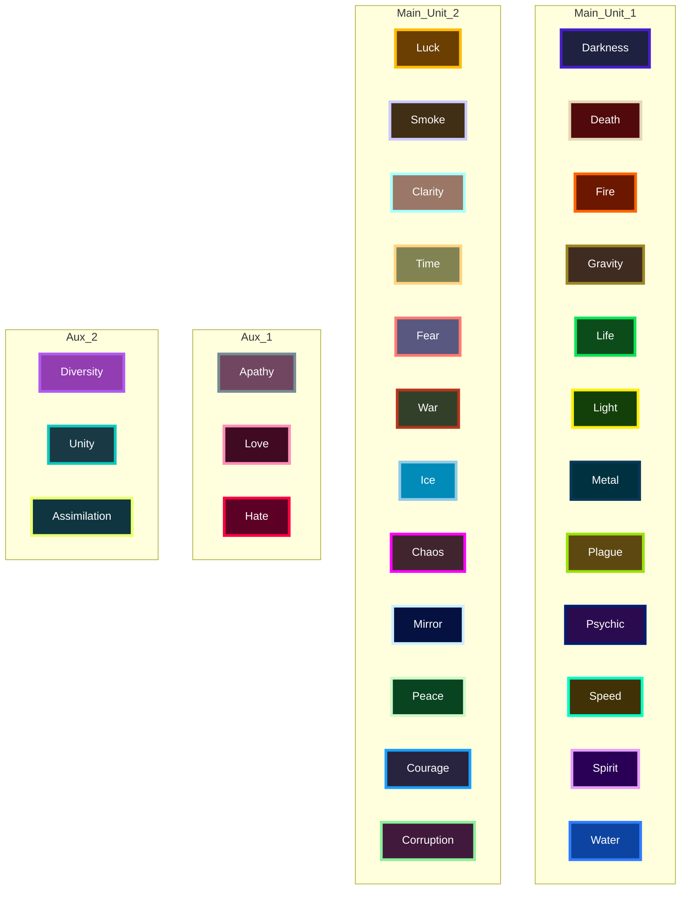
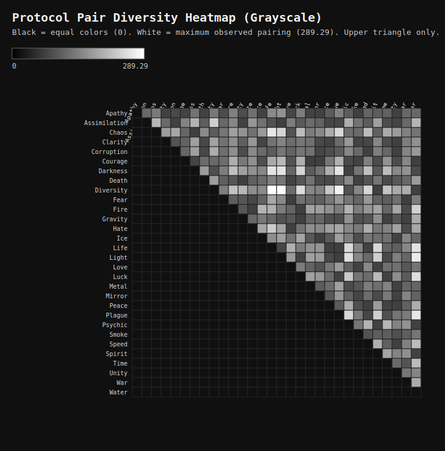

# Protocol Color Map

This map uses both protocol color dimensions in one node:

- Fill color = primary color (`PROTOCOL_COLORS`)
- Border color = accent color (`PROTOCOL_ACCENT_COLORS`)

## Hex Table

| Protocol | Primary | Accent |
|---|---|---|
| Apathy | `#704661` | `#768c93` |
| Darkness | `#1f2140` | `#451eca` |
| Death | `#52090b` | `#e3d8b6` |
| Fire | `#6c1800` | `#ff6501` |
| Gravity | `#402b21` | `#9c8724` |
| Hate | `#5c0026` | `#ff0042` |
| Life | `#0c4c1b` | `#0ee458` |
| Light | `#134008` | `#ffee09` |
| Love | `#400a23` | `#fe8fb8` |
| Metal | `#003140` | `#083859` |
| Plague | `#5e4812` | `#97e308` |
| Psychic | `#2b0b4f` | `#001d71` |
| Speed | `#403206` | `#00ffc3` |
| Spirit | `#290056` | `#e79dfc` |
| Water | `#0d44a1` | `#317cff` |
| Diversity | `#923db1` | `#af5aef` |
| Luck | `#6b3f02` | `#ffbc00` |
| Smoke | `#402e15` | `#ccc9fb` |
| Clarity | `#9a7766` | `#a7ffff` |
| Unity | `#193945` | `#0ec8bb` |
| Time | `#818352` | `#ffd482` |
| Fear | `#595881` | `#ff7a6f` |
| War | `#334029` | `#b6361a` |
| Ice | `#008bb9` | `#92cbe8` |
| Chaos | `#40252f` | `#ff00ff` |
| Mirror | `#051140` | `#ccf0ff` |
| Peace | `#094421` | `#cef9c7` |
| Assimilation | `#0e3540` | `#e9ff70` |
| Courage | `#282440` | `#18a0ff` |
| Corruption | `#40193c` | `#8cee9a` |

## Diversity Pairings and Grayscale Diagram

Pairing metric used:

`diversity(A,B) = deltaE76(primaryA, primaryB) + deltaE76(accentA, accentB)`

Grayscale mapping:
- Black (`#000000`) = equal colors (score `0`)
- White (`#ffffff`) = maximum observed pairing score in the current palette
- Diagram/table show only unique protocol pairs (upper-triangle view); mirrored duplicates and self-comparisons are intentionally omitted.

### 5 Lowest Diversity Pairings

| Rank | Protocol A | Protocol B | Diversity Score |
|---:|---|---|---:|
| 1 | Courage | Water | 71.67 |
| 2 | Life | Plague | 71.67 |
| 3 | Courage | Metal | 71.69 |
| 4 | Light | Plague | 71.70 |
| 5 | Apathy | Smoke | 71.71 |

Full pairings score table:
- [docs/protocol-diversity-pairings.md](protocol-diversity-pairings.md)

Grayscale diversity diagram:

